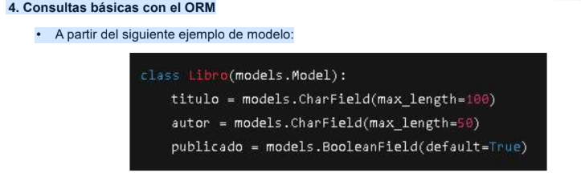

1. Bases de datos en Django
• ¿Qué función cumple una base de datos dentro de una aplicación Django?
    Permite mostrar,solicitar,guardar informacion relevante dentro de la aplicacion.
    
• ¿Qué sistemas de bases de datos relacionales soporta Django por defecto?
    Sistema de datos relacional, Oracle, PostgreSQL que es la que le da soporte o recomendacion por parte de django, SQL lite y MySQL.

• ¿Cuál es el motor de base de datos que se utiliza por defecto al crear un nuevo proyecto? ¿Por qué
    crees que es ese?
    El motor de base es SQL lite, porque es ligero, la informacion se guarda en un archivo para estar disponible    y puede usarse de manera local facilmente

2. ORM en Django
• ¿Qué es un ORM y cómo se diferencia de escribir sentencias SQL manualmente?
    ORM es un sistema dentro de django que contiene modelos,atributos e instancias. Permitiendo conectarse con el lenguaje de python a la bd . Se diferencian principalmente en la syntaxys de escritura en el crud a la bd como tambien traductir python a las filas de una tabla

• Menciona al menos dos ventajas de usar el ORM de Django.
    1. La ventaja principial es que te permite usar base de datos solo conociendo el lenguaje python sin la necesidad de tener que aprender el lenguaje SQL
    2. Al automatizar el mapeo entre las tablas y objetos, permite centrarse en la ejecucion de la logica del aplicativo en lugar de escribir consultas complejas en SQL

• Explica qué significa que una clase modelo en Python represente una tabla en la base de datos.
    Puede significar que al crear una clase model en python este pueda crear atributos que serian la representacion de columnas, generar los tipos de datos de cada atributo.

3. Migraciones
• ¿Qué son las migraciones en Django y por qué son importantes?
    Si se refiere a la migraciones como la carpeta, permite identificar a traves de un archivo intermedio entre python y la bd, el estado anterior y el actual para hacer una comparativa y poder ver los cambios que se deben aplicar a traves de los comandos determinados

¿Qué comandos se utilizan para:
• Crear una nueva migración a partir de cambios en los modelos
    python manage.py makemigrations
• Aplicar las migraciones a la base de datos
    python manage.py migrate

4. Consultas básicas con el ORM
• A partir del siguiente ejemplo de modelo:
    
Escribe cómo se realizarían las siguientes consultas usando el ORM de Django:
a) Obtener todos los libros
    Libro.objects.all()
b) Filtrar los libros por autor igual a "Cervantes"
    Libro.objects.filter(autor= 'Cervantes')
c) Obtener un libro específico por su id
    Libro.objects.get(id=1)