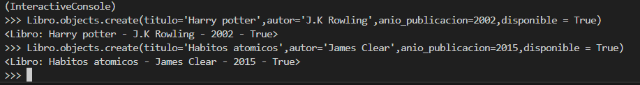
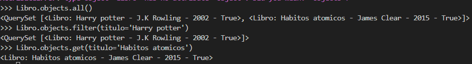
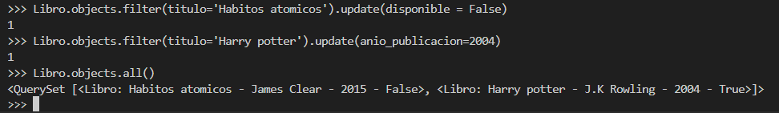
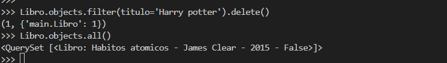
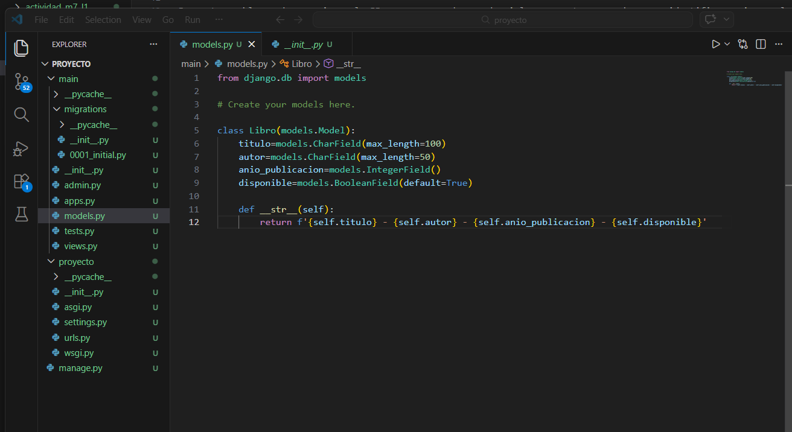
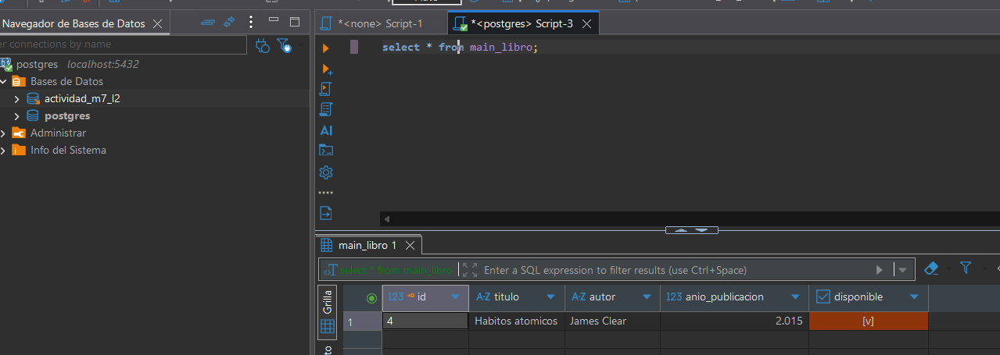

1. Conexion a PostgreSQL:
    pip install psycopg2-binary

2. Crear una base de datos llamada libreria

3. Configurar DATABASES en settings.py con las credenciales de mi BD:

4. Definicion del modelo:

    4.1. Indica que campo actuaria como clave primaria por defecto:
            Por detras del modelo, si no se espeficica la clave primaria estaria un campo id secuencial.
    4.2. Explica como se definiria una clave primaria compuesta si se quisiera hacer manualmente
            Al atributo que le queramos asignar la Primary Key debemos hacerlo con lo siguiente:
                Como parametro del tipo de dato, ejemplo: code = models.CharField(max_length= 10, primary_key=True)
                    Acordarse que CharField debe indicar si o si el max_length como parametro.

5. Aplicar migraciones:
    python manage.py makemigrations -> Lo que hace es hacer una comparacion entre el archivo original y otro con los cambios que se producieron para que se crea  un archivo la cual esta en modo en espera de confirmacion de los cambios.

    python manage.py migrate -> lo que hace es confirmar los datos anteriormente preaprobados y se implementar en la base de datos.

6. Operaciones CRUD(shell):

    6.1. Crear un libro:
            Libro.objects.create(titulo='Harry potter',autor='J.K.Rowling',anio_publicacion=2002,disponible=False)
    6.2. Listar todos los libros:
            Libro.objects.all()
    6.3. Actualizar el campo disponible de un libro:
            l = Libro.objects.get(titulo='Harry potter') 
            l.disponible = True 
            l.save()
        o tambien se puede usar:
            Libro.objects.filter(nombre='Harry potter').update(disponible=True)
    6.4. Eliminar un libro:
            obj = Libro.objects.get(nombre='Harry potter')
            obj.delete()
        o tambien se puede usar:
            Libro.objects.filter(nombre='Harry potter').delete()

PD: el metodo get o filter, va a depender principalmente la cantidad de registros que queramos actualizar o elminar, si queremos generar cambios a un listado de registros lo hacemos con filter en cambio si solo queremos cambiar un registro este tiene que ser unico en la bd para que no nos genere error sera con el metodo get.

7. Presente problemas de conexion a la BD por no recordar credenciales use estos comandos para identificar primero al usuario:
    SELECT current_user;
Una vez que supe el usuario cambie la contraseña con este otro comando:
    ALTER USER postgres WITH PASSWORD 'nueva_contraseña';
Asi pude cambiar la contraseña al usuario en cuestion y poder colocar las credenciales en el settings.

8. Evidencia: 
Creacion de Libros a traves de la shell:
    

Consultas all, get , filter:
    

Actualicaciones:
    

Delete Libro harry potter:
    

Models evidencia:
    

Bd evidencia:
    