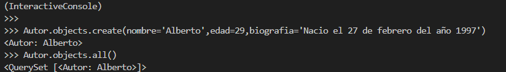
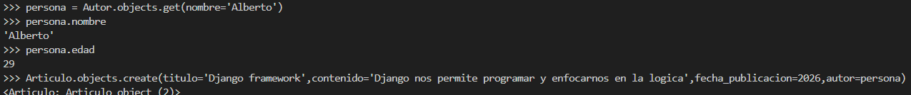
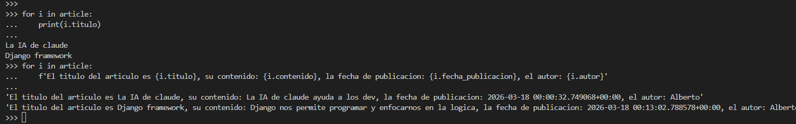

1.  Se crea el archivo README, Se crea el enviroment, se activa, se instala django, se crea el proyecto, se crea la app, lo nuevo es:
        Se instala pip install psycopg2-binary -> Se instalan los paquetes para la conexion entre python y postgreSQL
2.  Luego a configurar el proyecto, instalar la app en settings y lo nuevo es ir al apartado de DATABASES:
        Dar clik en el link que nos dirige a la documentacion, copiamos el codigo y pegamos segun la bd correspondiente en este caso postgreSQL:
            DATABASES = {
                    "default": {
                        "ENGINE": "django.db.backends.postgresql",
                        "NAME": "mydatabase",    ->Debemos cambiar por el nombre de la tabla creada
                        "USER": "mydatabaseuser",  ->Debemos cambiar por el nombre de usuario de la bd
                        "PASSWORD": "mypassword",  -> Debemos cambiar por la contraseña que tenemos de la bd
                        "HOST": "127.0.0.1",
                        "PORT": "5432",
                    }
            }
3.  Creamos los modelos, nos dirigimos a la consola bash para hacer las migraciones a la bd ejecutando los siguientes codigos:
        python manage.py makemigrations
        python manage.py migrate
4.  Escribimos a continuacion el comando para poder interactuar con los modelos y hacer uso de las consultas ORM:
        python manage.py shell
5.  Creamos primero que todo al autor porque es la entidad independiente con el siguiente codigo:
        Autor.objects.create(atributos=valores)
6.  Instanciamos al autor en una variable en espera de poder usarlo en la creacion de un articulo
7.  Creamos el articulo con el siguiente codigo y le pasamos la instancia al atributo que tiene asociado la relacion foreignkey, onetoone o manytomany segun     corresponda con la siguiente instruccion:
        Articulo.objects.create(atributos=valores, variable=Instancia)
8.  Luego decidi mostrar los articulos que tiene el autor=1 en un for y impriendo las variables del articulo

Evidencias:
    Autor creado:
        
    Creando instancia del autor y articulo nuevo creado:
        
    Mostrar articulos segun autor:
        