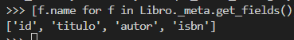
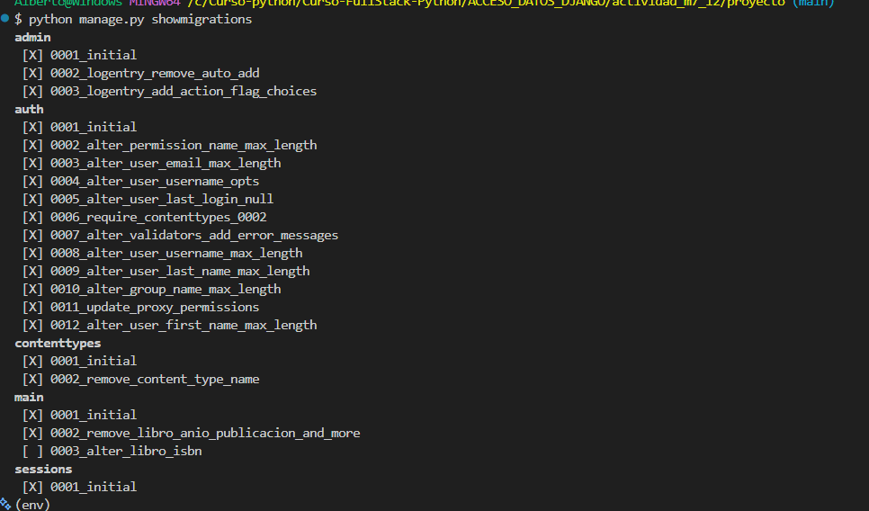

1. Comprensión teórica
Responde brevemente las siguientes preguntas:
• ¿Qué es una migración en Django?
    Una migracion es todo lo que se genero en los modelos de la aplicacion se traslada hacia la base de datos
• ¿Qué problema soluciona respecto a los cambios en los modelos?
    Soluciona el problema de volver a escribir todo el codigo manualmente en SQL para el CRUD en la base de datos
• ¿Por qué no basta con modificar el archivo models.py directamente sin hacer migraciones?
    Porque no se sincroniza con la informacion contenida de la base de datos por lo tanto no podremos manipular datos que no han sido migrados
2. Crear y aplicar migraciones
Utilizando una app existente de tu proyecto Django (por ejemplo, principal), realiza lo siguiente:
a) Agrega un nuevo campo a un modelo existente. Por ejemplo:
    isbn = models.CharField(max_length=13, null=True, blank=True)
b) Ejecuta los siguientes comandos y anota qué hace cada uno:
    python manage.py makemigrations -> Genera una lista de acciones que ocurrieron con los models y que estan en espera de ser confirmados para migrar a la bd
    python manage.py migrate -> Muesta las migraciones generadas y confirmadas para sincronizarse con la bd mostrando un status al aplicar los cambios
c) Verifica desde el admin o el shell que el nuevo campo isbn esté disponible en la base de datos.
    

3. Aplicar migraciones existentes
• Elimina el archivo de migración generado (solo con fines pedagógicos, no en producción).
• Vuelve a ejecutar makemigrations y migrate.
• Describe lo que sucede si no aplicas una migración pendiente.
    Al momento de ejecutar el comando makemigrations me aparece el listado de acciones que se hicieron en los modelos como normalmente es el flujo, ahora lo raro que al ejecturar el comando migrate no aparecen las migraciones aplicadas al listado.
    Osea que el archivo que genera makemigrations es para tener un historial de las acciones realizadas a los modelos y el migrate es mas para sincronizar los cambios a la base de datos, una vez ya realizados no los vuelve a hacer.
4. Opcional: Revisión de estado
Ejecuta el comando:
    python manage.py showmigrations
• Comenta qué información te entrega y cómo puedes saber qué migraciones ya se aplicaron.
    La informacion que entrega, son por categoria: admin,auth,contenttypes,main (la aplicacion),sessions. Cada una contiene los cambios que se realizaron o estan pendientes de realizarse, como uno determina cuales aplicaciones se aplicaron. Entre corchetes se encuentra una X al lado de la accion realizada. y los que no han aplicado la migracion los corchetes se encuentran vacios. 

    