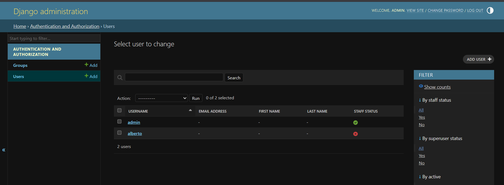

1. ¿Qué son las aplicaciones preinstaladas?
• Define brevemente qué es una aplicación “preinstalada” en Django.
    Son paquetes que vienen incluidos por defecto en Django para resolver tareas generales como auth y administracion sin que tengamos que programarlas desde cero

• ¿Dónde se declaran y activan estas aplicaciones en un proyecto?
    Se declaran y activan en el archivo settings.py, específicamente dentro de la lista INSTALLED_APPS.

• Copia y pega el bloque INSTALLED_APPS de tu archivo settings.py y comenta qué hace cada una
de estas apps:
    INSTALLED_APPS = [
        'django.contrib.admin',        # Panel de administración automático para gestionar modelos.
        'django.contrib.auth',         # Sistema de autenticación usuarios permisos y grupos.
        'django.contrib.contenttypes', # Permite que los permisos se asocien a modelos específicos.
        'django.contrib.sessions',      # Maneja el almacenamiento de datos de usuario de forma temporal.
        'django.contrib.messages',      # Permite enviar notificaciones "flash" (ej: "Libro guardado").
        'django.contrib.staticfiles',  # Gestiona archivos CSS, JS e imágenes del proyecto.
        'libros',                      # Mi aplicación de libros (la que creamos nosotros).
    ]

2. Interacción con modelos preinstalados
Desde el shell de Django (python manage.py shell), importa y explora algunos modelos de las
aplicaciones preinstaladas:

Crea un usuario con User.objects.create_user()
• Asigna el usuario a un grupo
    >>> from django.contrib.auth.models import User, Group
    >>> from django.contrib.sessions.models import Session

    >>> usuario = User.objects.create_user(username='alberto', password='password123')
    >>> group, created = Group.objects.get_or_create(name='Editores')
    >>> user.groups.add(group)
    Traceback (most recent call last):
      File "<console>", line 1, in <module>
    NameError: name 'user' is not defined. Did you mean: 'User'?
    >>> usuario.groups.add(group)

• Consulta las sesiones activas con Session.objects.all()
    >>> print(Session.objects.all())
    <QuerySet []>
    >>>
Documenta cada paso y lo que observas.
    la lista aparece vacia al momentos de consultar las sesiones activas porque el proyecto recien se creo y nadie se ha logeado <QuerySet []>. Solo aparecen registros cuando un usuario inicia sesión en el navegador.

3. Acceso desde el Admin
• Asegúrate de tener el sitio admin habilitado.
• Crea un superusuario y accede al panel en http://localhost:8000/admin.
• Toma una captura de pantalla del panel de administración mostrando alguno de los modelos
preinstalados activos (Usuarios, Grupos, Sesiones, etc.)
    
    Aparecen las secciones "Authentication and Authorization" (con Usuarios y Grupos)
4. Reflexión final
Responde brevemente:
• ¿Cuál de estas aplicaciones crees que es más importante para el desarrollo de una aplicación real y porqué?
    Para mi django.contrib.auth. En cualquier aplicación real necesitas manejar quién entra y qué puede hacer. Que Django ya traiga una tabla de usuarios segura te ahorra meses de trabajo y evita errores de seguridad graves.
• ¿Qué te llamó la atención al explorar el sistema de administración de Django?
    Lo que más me sorprendió es cómo están conectadas las apps. Por ejemplo, que el Admin use a Auth para dejarte entrar, y que use Messages para avisarte cuando borraste algo. Todo el ecosistema preinstalado trabaja en equipo de forma transparente.