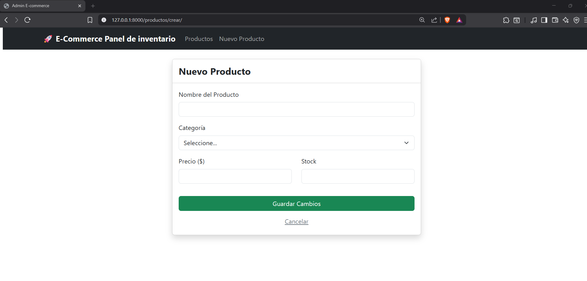
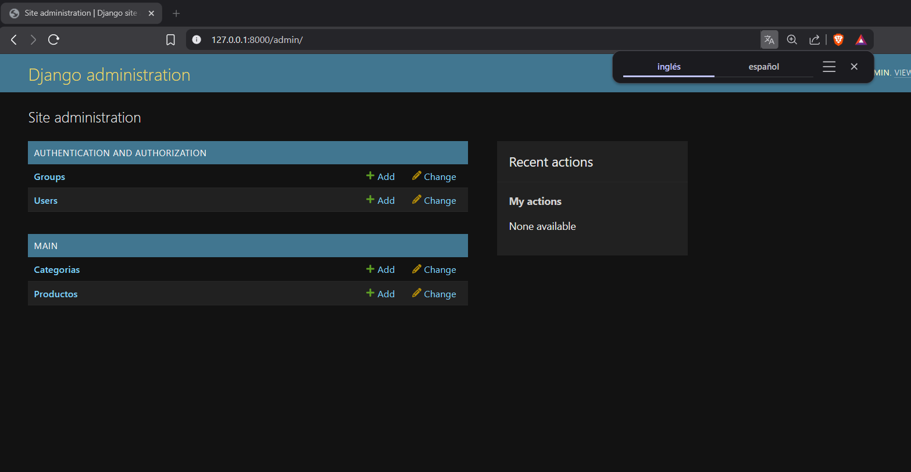

E-commerce Admin Dashboard - Django CRUD

Este proyecto es un sistema de administración de catálogo para un e-commerce, desarrollado con Django. Permite gestionar productos y categorías mediante un CRUD.

---

Motor base de datos:

PostgreSQL Conectado mediante psycopg2-binary

---

Modelo de Datos
El sistema utiliza una relación de Muchos a Uno:
Categoría:
    nombre de la categoria
Producto:
    Contiene los campos: nombre, precio, stock, ForeignKey a Categoría.

Rutas Principales:

    'productos/' 
    'productos/crear/'
    'productos/editar/<int:id>/'
    'productos/eliminar/<int:id>/'

Pasos para ejecutar el proyecto:
    Descarga y extrae el archivo zip.
    Abre la terminal bash con el proyecto :
        python -m venv env
        source env/Scripts/activate

Evidencias:
    
    
    