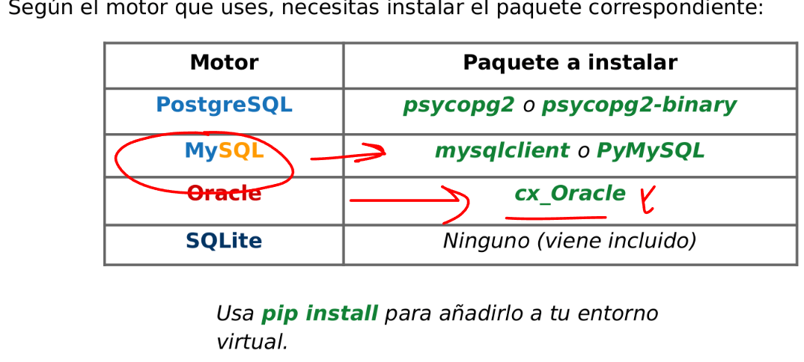
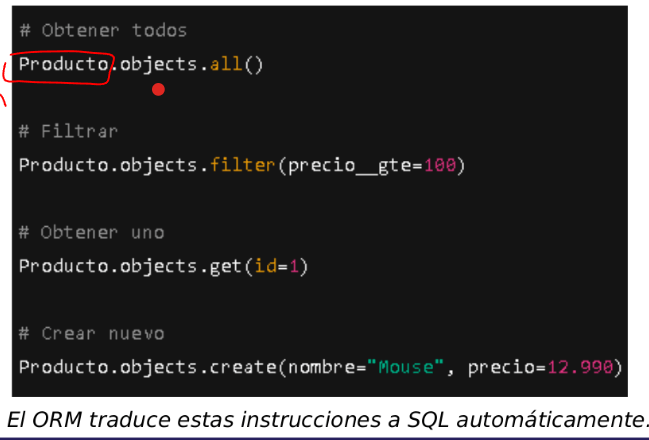
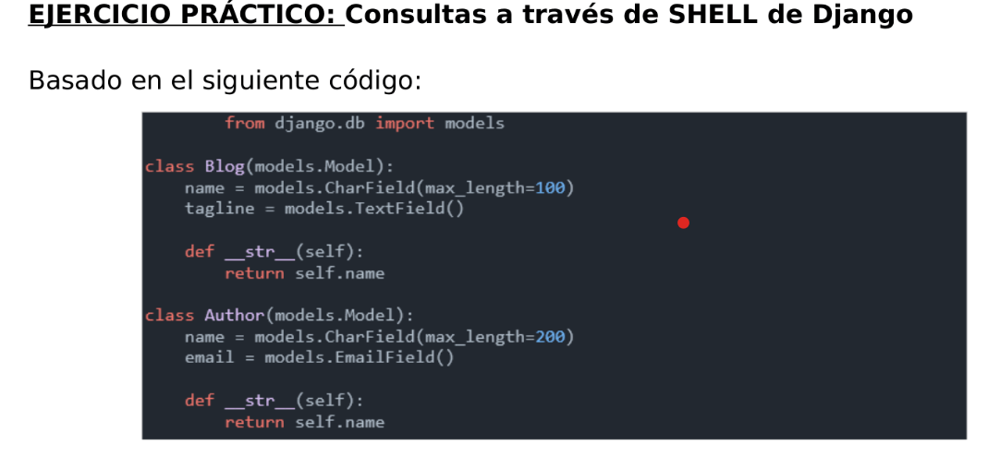

La ORM nos permite:
    Conectarse desde el aplicativo con syntaxys python a la base de datos.
    Haciendo consultas a base de datos mediante python

Como se conecta django con la bd:
    En el archivo settings del proyecto aparece un diccionario llamado DATABASES que contiene las keys para hacer la coneccion, solamente debemos configurarla a nuestra bd y estara conectada.
        Ej: 
            DATABASES = {
                'default': {
                    'ENGINE': 'django.db.backends.postgresql',
                    'NAME': 'mi_basedatos',
                    'USER': 'mi_usuario',
                    'PASSWORD': 'secreta',
                    'HOST': 'localhost',
                    'PORT': '5432',
    }
}

Las migraciones:
    El comando python manage.py makemigrations hara lo siguiente:
        Va a identificar los modelos que existen en la carpeta model y lo traspasara a un lenguaje de python quedando a la espera confirmar los cambios
    El comando python migrate.py migrate hara lo siguiente:
        Hara los cambios correspondiente a las tablas, desde cambiar un valor hasta creacion,actualizacion,eliminacion de tablas. se comporta como un commit

Segun el motor que uses necesitas instalar el paquete correspondiente:
    

Sqlite es una base de datos que permise una base de datos ligera y sin sevidor, guardando los datos en un archivo local. Siendo predeterminada para django. No es buena en escabilidad.

En caso de usar SQL Puro en codigo en los archivos python , no hacerlo porque conduciria a injection SQL mala practica. Solo usar el ORM de django para conectarse y consultar a la bd

Django como ORM:
    Estan los modelos que es igual a una clase y se comporta como una tabla si hacemos la comparacion 
    Estan los atributos que serian las columnas de la tabla
    Estan las instancias que hace referencia a la fila de la columna

Consultas con el ORM de django:
    

    Producto.objects.all():
        Se desglosa que el producto es la tabla, all() te trae todos los valores de la tabla en comparativa al SQL seria este codigo:
            Select * from producto
    
    Producto.objects.filter(precio__gte=100):
        Se desglosa que el produco es la tabla, filter es un filtro que le pasamos por parametro indicando que me traiga los productos que el precio sea igual a 100 en comparativa al SQL seria este codigo:
            Select * from producto where precio__gte=100
    
    Producto.objetcs.get(id=1):
        Se desglosa que el producto es la tabla, y el get es para obtener el campo especifico en comparativa al SQL seria este codigo:
            Select * from tabla where id=1
    
    Producto.objetcs.create(name='Mouse' precio=12.500):
        Se desglosa que el producto es la tabla, el objects la instancia, y el create es para insertar nuevos valores a la tabla en comparativa al SQL seria:
            INSERT INTO nombre,precio from producto VALUES('Mouse',12500)

Como se desglosa el modelo creado en python:
    

    Blog: significaria la CLASE en comparativa seria la Tabla de la BD
    name y tagline: significaria ser los atributos en comparativa seria las columnas de la BD
    .Charfield() y .TextField(): significaria ser el tipo de dato en comparativa serian VARCHAR, INT, FLOAT, etc.

Para configurar la DATABASES de settings.py, hay un link que te lleva la documentacion para poder copiar el codigo, cambiar los valores de las keys por la de nuestra bd y estaria listo para usar 