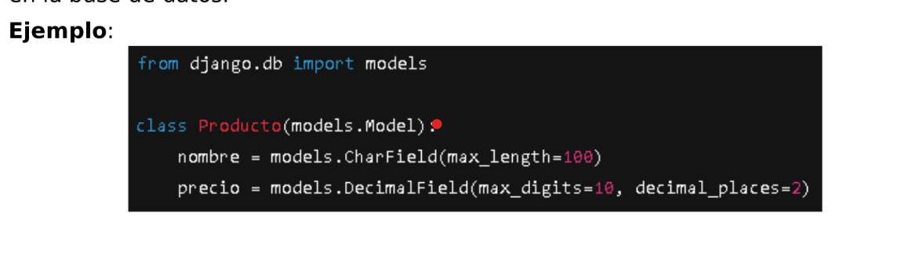

Que es un modelo:
    Es una clase que define la estructura que tendra la tabla en la bd
    

La clase recibe como parametros models.Models que se importa models desde django.db.
Significa que el parametro trae todas las propiedades que tiene models integrado en django.
Cada uno de los atributos de la clase, seran las columnas de la bd, 

Campos y tipos de datos mas comunes:
    CharField -> texto corto
    TextField -> texto largo (tipo parrafos de informacion)
    IntegerField -> numeros enteros
    DecimalField -> numeros con decimales
    DateField -> la Fecha
    DateTimeField -> fecha y hora
    BooleanField -> Tipo booleano

    Como tambien le podemos otorgar al tipo de dato que puede ser nulo, blank, o tener un valor por defecto.

Max_length como parametros a los tipos de dato, que significaria darle un maximo de caracteres en el campo.

Claves primarias:
    Cuando uno crea un modelo, por defecto, django automaticamente por abajo del modelo ya creo un campo id, y ese campo tiene la caracteristicas de ser unico y serial que va aumentando.
    Si quisiera yo declarar una primary key lo que deberia hacer es entregarle como parametro al tipo de dato el siguiente parametro -> primary_key=True lo que al final quedaria de esta forma el atributo:
        codigo = models.Charfield(max_length=10, primary_key=True)
    Al darle esa propiedad de primary_key, pasa por defecto a que ese atributo ya no sea nulo y blanco.
    A diferencia de los otros atributos comunes que puede ser nulo o blanco.

    Llaves primarias unicas y compuestas:
        Una sola columna puede ser primary_key, las primary_key compuestas django no las permite pero se pueden simular para que 2 columnas puedan identificarse como un campo unico y no tener valores duplicados y no saber cual corresponde a cual por ejemplo:
            id = 1 codigo = 101 periodo = 2025
            id = 2 codigo = 101 periodo = 2025
        Esto lo permite la base de datos pero estaria erroneo porque estas teniendo 2 registros con los mismos valores pero sin identificar cual es cual

CRUD:
    Para crear objetos con el modelo ORM:
        Producto.objects.create(nombre= 'Teclado', precio =19990)
    Tambien se puedee usar una instancia:
        p= Producto(nombre= 'Teclado', precio =19990)
        p.save()

    Para leer objetos con el modelo ORM:
        Producto.objects.all() -> Nos trae todos los registros de la tabla
        Producto.objects.get(id=1) -> Nos trae un registro en especifico
        Producto.objects.filter(precio__gt=10000) -> Nos trae registros con condiciones

        La diferencia entre get y filter es según lo esperado cuando tratas de buscar un registro unico ocupa get, si es que buscar un listado de registros a traves de un filtrado con condiciones ocupa filter.

        ***Ademas la diferencia mas importante es que el filter, crea un objeto iterable y el get no es iterable ni indexable me trae solo 1 objeto.  Por lo tanto para recorrer el objeto deberia hacer uso de filter.***   
    
    Para actualizar objetos con el modelo ORM:
        p = Producto.objects.get(id=1) -> Aca se le asigna el registro condicionado 
        p.precio = 15990 -> aca se le modifica el precio del registro condicinado
        p.save() -> aca se guarda el cambio
        Yo usaria este para cambiar un solo un registro
    Tambien puedes usar:
        Producto.objects.filter(nombre='Mouse').update(precio=9990) -> Este lo ocuparia para actualizar el campo para un  listado de registros           condicionados

Creacion del proyecto en concreto los modelos en models.py de la app:
    from django.db import models
    
    class Persona(models.Model):
    #A los Charfield debes asignarle un max_length obligatoriamente#
    #Aca agregas las columnas(atributos)
    nombre = models.CharField(max_length=20)
    apellido =models.CharField(max_length=20)
    edad =models.IntegerField()
    f_nacimiento=models.DateField
    nacionalidad=models.CharField(max_length=20)

Usar modelo en sitio admin.py de la app:
    #Importamos la clase a utilizar
    importamos .models import Persona

    admin.site.register(Persona)

Debemos botar el servidor
Debemos hacer uso de python manage.py makemigrations -> para cargar el modelo nuevo 
Para luego hacer los cambios permanentes con python manage.py migrate
Crear el superusuario con python manage.py createsuperuser
Ir al servidor y ingresar el endpoint de panel de control para ingresar 

Ademas para que la base de datos muestre los datos de la Persona debemos incurrir a el metodo __str__ dentro del modelo creado retornando los atributos que queremos que se vean ej:
        def __str__():
            return f'{self.nombre} {self.apellido}'
Para luego en el panel de administrador puedo crear,leer,editarlos y eliminarlos desde la interfaz grafica del panel de admin en django. La mas sencilla y lenta de hacer. No la ocuparemos pero no esta demas saber lo que se puede hacer a traves de panel de admin.

Al corregir un atributo, o agregamos parametros a los tipos de datos, debemos hacer el siguiente proceso nuevamente:
    Debemos botar el servidor
    Debemos hacer uso de python manage.py makemigrations -> para cargar el modelo con sus cambios
    Para luego hacer los cambios permanentes con python manage.py migrate

Django nos permite interactuar de manera probatoria con la terminal shell que tiene incluidos los modelos para hacer consultas,agregar,actualizar,borrar con el siguiente comando:
    python manage.py shell

    Ademas en la consola debemos importar lo que vamos a utilizar en este caso importaremos lo siguiente:
        from aplicativo.models import Persona
    Ya una vez realizado lo anterior podemos hacer las consultas por ORM a los modelos como prueba:
        Persona.objects.create(nombre='Alberto', apellido='Fernandez',edad=29,f_nacimiento=1997-02-1997(formato es YYYY-MM-DD),nacionalidad='Chilena')

Actividad -> practica de la ORM con la consola shell y usar los modelos creados, ademas entender el uso del filter y get para poder usarlo con indexado y no indexado.