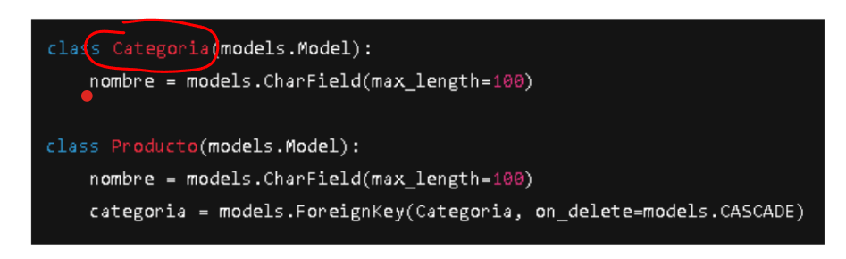
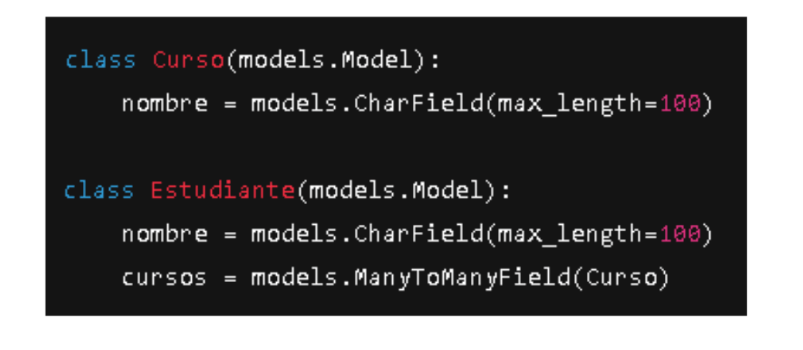
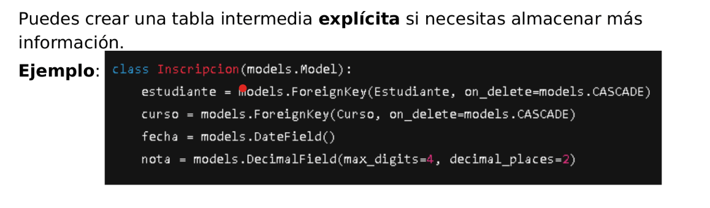
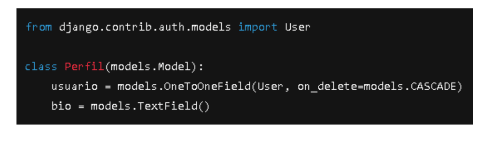

Relaciones entre modelos
    El orm permite relaciones entre modelos(tablas) los relaciones se llaman asi en el ORM:
        Uno a uno -> OneToOneField
        Uno a muchos -> ForeignKey
        Muchos a muchos -> ManyToManyField

Cuando y como se usa una FreignKey o OneToOneField o ManyToManyField:
    
    
    Tenemos 2 modelos que son las tablas en este caso Categoria o Producto:
        En este cago la categoria tiene como padre el producto por lo tanto la relacion debe estar en PRODUCTO, como se relacionan:
            Se crea un atributo con nombre referenciando al modelo, indicandole luego de models. cual relacion es la que tienen los 2 modelos y pasando por parametro la clase Categoria en este caso y on_delete=models.CASCADE (Esto permite borrar el registro en ambos modelos si es que se borra desde Producto o desde Categoria). Ahora si es que se borra desde Producto no pasa nada a Categoria porque el dato se guarda dentro de Productos. Ejemplo de relacion entre 2 modelos 1 a muchos:
            class Producto(models.model):
                nombre= models.Charfield(max_length=100)
                categoria= models.ForeignKey(Categoria, on_detele=models.CASCADE)

Borrado en cascada (on_delete):
    El parametro determina que pasa con los objetos si el objeto padre se elimina, las opciones mas comunes son:
        1.CASCADE: elimina a los hijos automaticamente
        2.SET_NULL: deja el campo vacio, se requiere pasar (null=True) por parametro
        3.PROTECT: lanza un error si es que intentas eliminar el objeto relacionado

Cuando y como se usa muchos a muchos:
    
    Se le entrega por parametro al atributo referenciando el modelo con el que se tiene relacion, indicandole que relacion tienen entre las tablas.
        Ej donde los 2 modelos son Curso y Estudiante img de referencia:
            cursos = models.ManyToManyField(Curso)

Entidades intermedias personalizadas:
    
    Se puede crear una tabla intermedia ocupando el caso anterior con los modelos curso y estudiante. La relacion aunque se crea que puede ser muchos a muchos, en el caso de tablas intermedias la relacion debe ser ForeignKey por cada uno de los modelos relacionados.
        Ej :
            class Inscripcion(models.Model):
                estudiante = models.ForeignKey(Estudiante, on_delete=models.CASCADE)
                curso = models.FreignKey(Curso, on_detele=models.CASCADE)
                y los otros atributos propios del modelo Inscripcion....

Cuando y como se usa (Uno a uno):
    Se importa user porque es parte del auth de django por lo tanto es un objeto (modelo) ya construido:
        from django.contrib.auth.models import User
    
        Como en los demas hacemos lo mismo pasandole por parametro el (Modelo,Objeto o la Clase que es lo mismo) indicandole que relacion tiene en este caso OneToOneField
    ***Sirve para extender modelos sin modificar los que ya existen***

