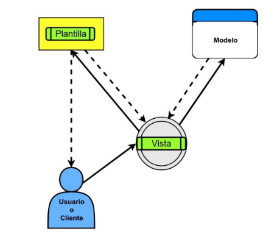

El utilitario manage.py - createsuperuser
    Se crea un superusuario usando el comando: python manage.py createsuperuser, creada por defecto permite acceder a todos los permisos dentro de la app
Otros comandos:
    runserver: permite iniciar el servidor de desarrollo
    starproject: Crea el proyecto 
    startapp: Crea la app dentro del proyecto
    makemigrations: Crear archivos de migracion para hacer los cambios en los modelos
    migrate: Aplica los cambios pendientes a la base de datos
    shell: Interfaz de consulta de prueba para realizar consultas a la base de datos

Lo que hacen makemigrations y migrate es configurar la estructura de los datos en formato de tabla en el archivo models.py, responsable de tomar nuestro modelos e integrarlos a la base de datos.

Archivos de configuracion settings.py
    BASE_DIR: La direccion raiz donde se encuentra nuestro proyecto
    SECRET_KEY: mantener las contraseñas ocultas dentro del codigo
    DEBUG_TRUE o FALSE: TRUE,Permite obtener los logs de los errores y en que linea se encuentra apareciendo en la consola del proyecto. En 
        FALSE no nos detalla el error ni tampoco en que linea se encuentro.
    ALLOWED_HOSTS: Una lista de quien tiene acceso a la aplicacion.
    INSTALLED_APPS: Las aplicacione instaladas en la app que vayamos a crear o utilizar
    TEMPLATES: 
    DATABASES: Configuracion de conexion a la base de datos
    STATIC_URL: Acceso a la carpeta que contiene los archivos estaticos para utilizar en el proyecto

TEMPLATES: Un archivo html que se le muestra al usuario, que hace django con el template: 
    URL, es la direccion a la cual quiero dirijirme dentro de la app y el usuario hace la peticion
    luego pasa por la VIEW, que esta la logica para ver si me muestra un TEMPLATE o el MODEL para consultar la bd y responderle al usuario sobre su peticion.

    
    Se detalla en la imagen, el usuario realiza una peticion. ejemplos: 
    1. ingresar a la pagina web por el URL, luego la VIEW interpreta la logica de la peticion por lo cual va a devolver un TEMPLATE.
    2. Si el usuario esta en el login e introduce las credenciales para entrar al perfil, la VIEW va hacia el MODEL para verificar si el usuario existe en la bd devolviendole una respuesta ya sea positiva que significaria mostrarte el TEMPLATE de su perfil o puede ser negativa indicandole a traves de un mensaje,alerta que las credenciales no existen, usuario incorrecto, crear cuenta, etc...

Configuracion de un proyecto - settings.py
    STATIC_URL = '/static/'
    STATIC_ROOT = os.path.join(BASE_DIR, 'static')
Los archivos estaticos, son las imagenes, o archivo que se usaran dentro del proyecto.

TEMPLATES el motor en django es jinga2.

******UNA VIEW ES UNA FUNCION QUE RECIBE UNA REQUEST Y RETORNA UNA RESPUESTA*******

ACTUALIZACION DE COMO SE COMPORTA EL URL,VIEW Y TEMPLATE

Despues de crear el proyecto y app
Escribimos el nombre de la app en INSTALLED_APPS en settings.py de la carpeta del proyecto
Luego VIEW de la app y escribimos la funcion que queremos que retorne algo importanto HTTPresponse
Creamos la funcion y retornamos algo
Vamos a Urls del proyecto y desde nombredelaapp importamos views
Escribimos dentro del urlpatterns la direccion de la ulr que queremos que se vea, e colocamos views.nombredelafuncion
SENCILLOOOO

