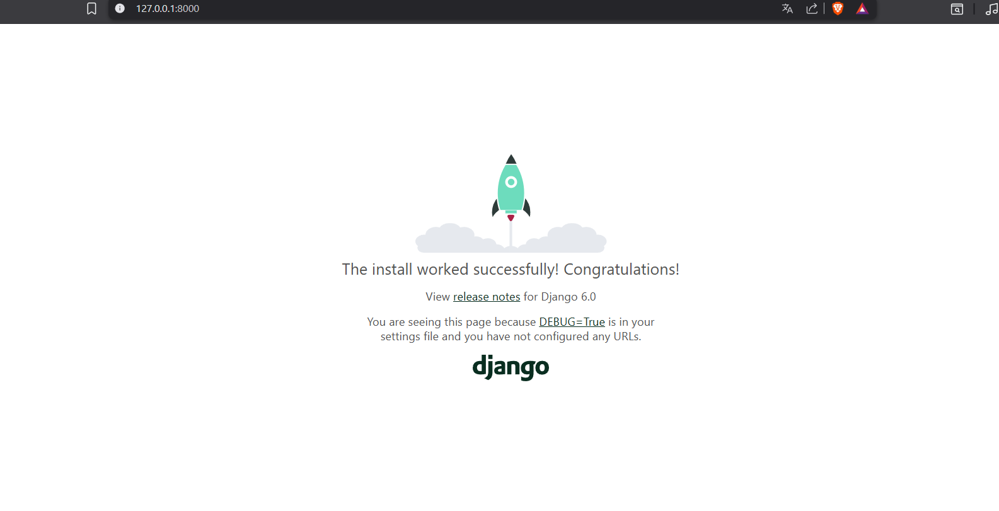

1. Instalacion en entorno virtual:
    1.1 Instalar el entorno virtual con el comando: python -m venv env
    1.2 Activar el entorno virtual con el comando: source env/Scripts/activate
    1.3 Instalar Django con el comando: pip install django

1.4 ¿Que es pip? : Es el instalador que nos permite ocupar librerias que vienen por defecto 

1.5 ¿Que ventajas nos ofrece instalar django en un entorno virtual? : Nos permite establecer una version en especifica de django según     la necesidad del proyecto a construir

2. Crear el proyecto:
    2.1 Instalar el proyecto con django-admin startproject mi_sitio
    2.2 Explicando para que sirve cada uno de los siguientes elementos:
        2.2.1 manage.py: Sirve para interactuar a traves de lineas de comando con el proyecto ej. python manage.py runserver
        2.2.2 settings.py: Permita configurar el proyecto conectandose con la base de datos, instalando aplicaciones y creando rutas        estaticas
        2.2.3 urls.py : Sirve para colocar el enrutamiento de las paginas 
        2.2.4 wsgi.py : Permite desplegar el proyecto y servicio web
        2.2.5 asgi.py : Archivo que permite desplegar y servicio web
        2.2.6 __init__.py : Archivo que permite reconocer los archivos en django como paquetes para que puedan ser importados los modulos dentro del proyecto ej. python manage.py, si no existiese init podria indicar que el modulo que ejecute en el comando no se reconoce

3. Ejecutar el servidor: 
    3.1 Ingresa a la carpeta del proyecto mi_sitio con el comando : cd mi_sitio
    3.2 Para correr el servidor escribir el comando : python manage.py runserver
    3.3 Imagen de el servidor corriendo:
        

4. Crear una aplicacion:
    4.1 Crear una aplicacion con el siguiente comando: python manage.py startapp principal
    4.2 ¿Que diferencias hay entre un proyecto y una aplicacion en Django?
            El proyecto contiene las carpetas de configuracion, mientras tanto la aplicacion contiene la logica de negocio que quiere aplicar ya sea el front, backend, conexiones a bd.
    4.3 ¿Que carpetas se generan dentro de la app principal?
            -__init__.py, que permite importar los modulos dentro de los archivos de la app como paquetes.
            -admin.py, permite al usuario administrar el panel de control 
            -apps.py, permite configurar la app
            -models.py, permite generar tablas para la bd, estructura de los datos.
            -views.py, permite crear las vistas que van a interactuar con el usuario
            -test.py, permite hacer pruebas unitarias o de integracion.

5. Configuracion del proyecto:
    5.1 Agregar la app llamada principal al INSTALLED_APPS ingresando a settings.py del proyecto.
    5.2 Crea un archivo urls.py dentro de la app llamada principal y configura el enrutamiento en mi_sitio/urls.py para que dirija hacia esa app
        Pasos que tuve que seguir para generar el enrutamiento de la app llamada principal:
            1.Generar la funcion para mostrar mensaje en pantalla de inicio en el archivo views.py
            2.Importar desde django.http, HttpResponse
            3.Crear la funcion:
                Por defecto HttpResponse es un objeto por lo tanto esta recibiendo en la funcion el parametro que viene por defecto de HttpResponse que es request, si es que no se lo colocamos el programa me estara diciendo que me dio un argumento pero la funcion no trae ningun parametro.

                def app(request):
                    retornando un string: HttpResponse('¡Bienvenido a mi sitio!')

            4. Crear el archivo urls.py dentro de la app
            5. Importar en el archivo urls.py de la app, las view de la app en este caso traje todo indicandole con un punto. 
                Ademas de importar el path a traves de django.urls
            6. Crear el urlpatterns [ La cual contiene la ruta a la funcion creada en views.py que quiero mostrar en la vista llamandola con views.app (*** app es el nombre que le puse yo a la funcion *** ) ]
            7. Nos dirijimos a ulrs.py dentro del proyecto, importamos include despues del path.
                En urlpatterns path(['', include((nombreDeLaApp En este caso principal por lo tanto seria ->) 'principal.urls')])

