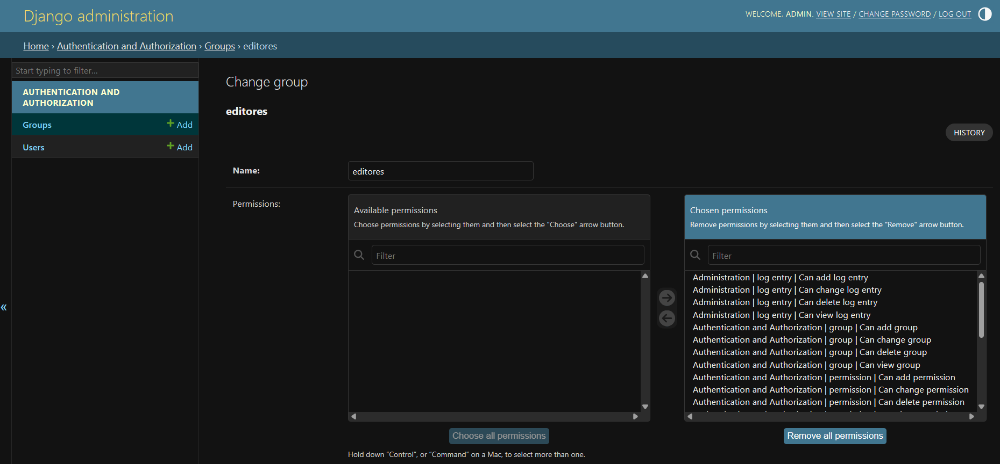
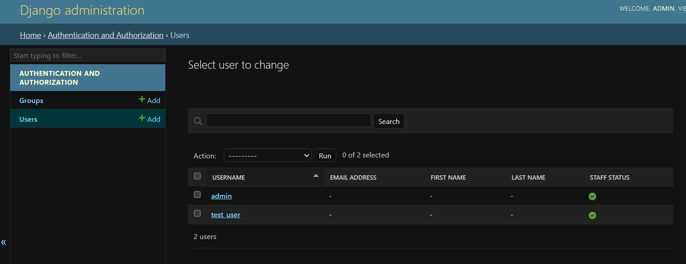
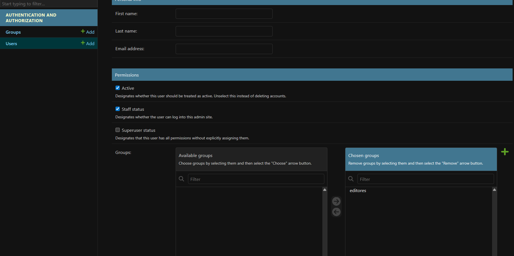

Implementacion del caso:
    Siguiendo con el proyecto de seguridad_acceso_django, una vez creado el proyecto incurri en los siguientes pasos:
    1. python manage.py createsuperuser
    2. Ingresar al endpoint /admin
    3. crear al user manualmente
    4. Crear grupo y otorgarles permisos
    5. Asignar al user los permisos de grupo
    6. Hacer el user staff
    7. Rellenar campo con informacion personal

A continuacion evidencia de cambios en el panel de admin:
    1.Los cambios entregados al grupo
        
    2. Creacion de usuario dandole permisos de staff
        
    3. Dandole permiso de grupo al usuario test_user
        

