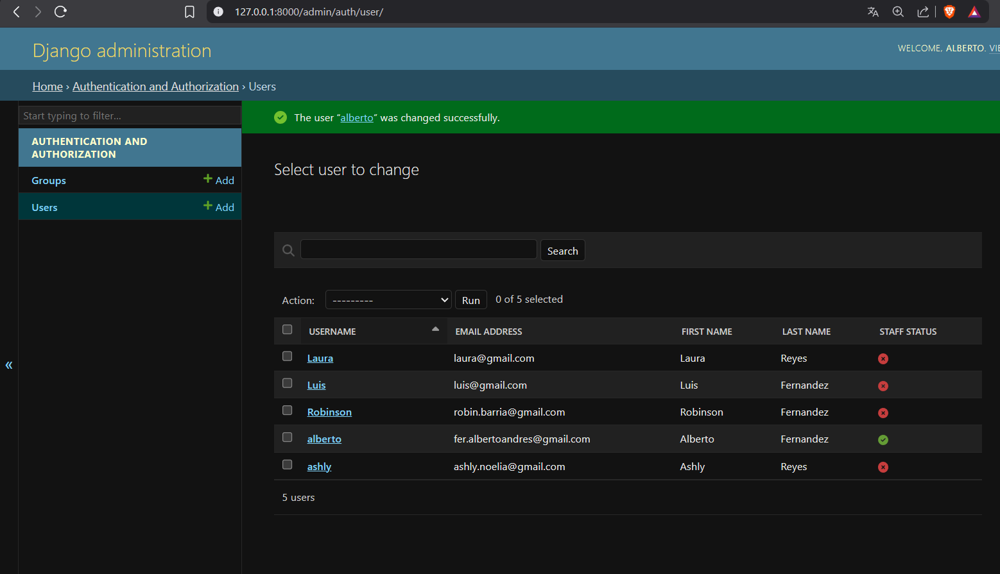
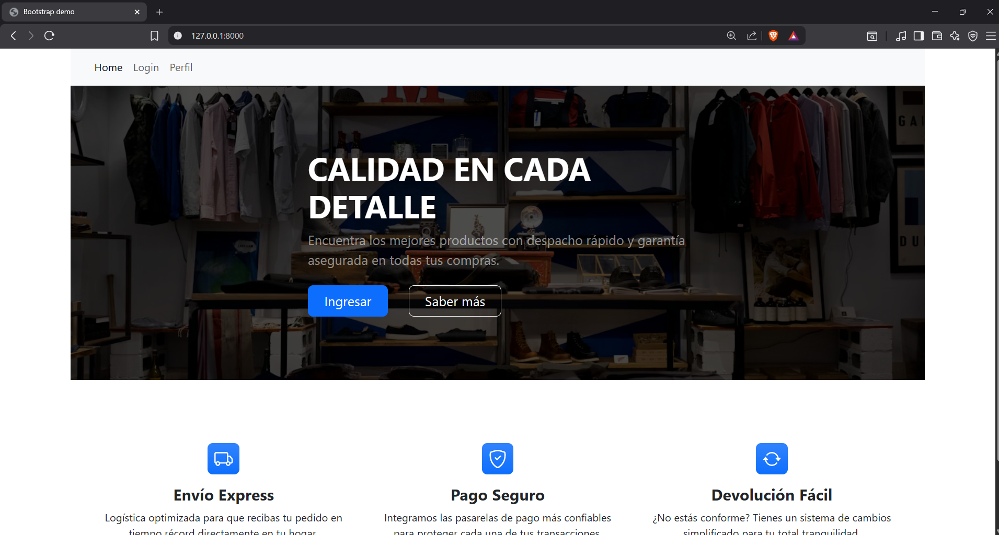
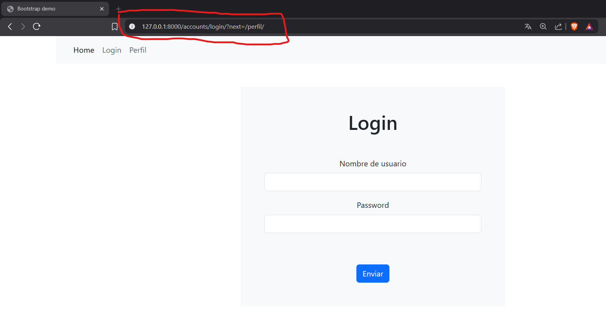
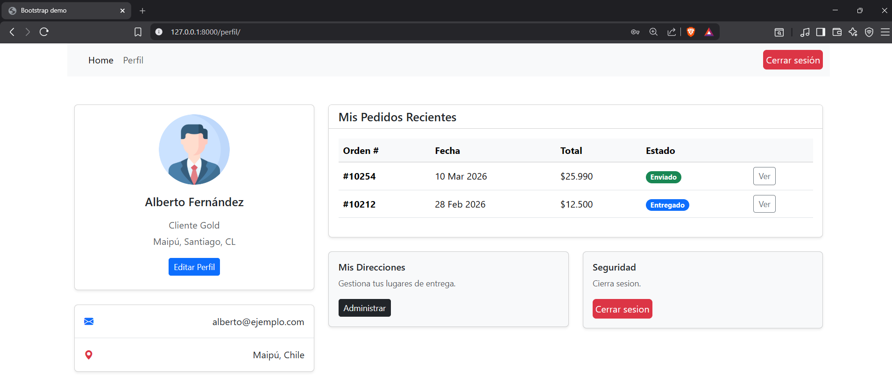

Pasos para ejecutar el proyecto:
    1. Crear entorno virtual python -m venv env
    2. Activar entorno virtual en git source env/Scripts/activate
    3. Instalar dependencias con el comando:
        pip install -r requirements.txt
    4. Ejecutar las migraciones 
        python manage.py migrate 
    5. Iniciar el servidor
        python manage.py runserver

Rutas principales:
    path('perfil/', views.perfil, name='perfil'),
    path('', views.home, name='home'),

Evidencia de creacion de usuarios en el panel de administracion:
    

Evidencia del Home:
    
Evidencia del login y la restriccion a la vista protegida:
    
Evidencia del perfil, tambien esta el boton del logout en el navbar ademas de quitar la pestaña login del navbar una vez logeado:
    

PD: Se uso IA para generacion de contenido del html. No asi para la autenticacion de usuario, la logica, formularios ,configuracion de lo requerido, herencia de html.
    Como el objetivo es la navegacion, el auth, uso del template base, vista protegidas, me tome la libertad de hacer uso para la visual del contenido html.

